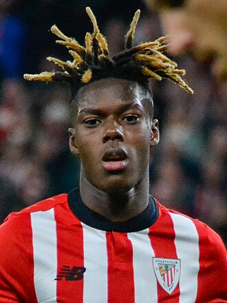

# **Nico Williams**

**Izen-abizenak:** Nicholas Williams Arthuer  
**Jaioteguna:** 2002ko uztailaren 12a  
**Jaioterria:** Iruñea (Nafarroa, Espainia)  
**Nazionalitatea:** Espainiarra  
**Altuera:** 1,81 m  
**Pisua:** ~75 kg  
**Postua:** Hegalekoa (ezker hegala / eskuin hegala)  
**Oina:** Eskuina  

---

## **Aurkibidea**

- [**Nico Williams**](#nico-williams)
  - [**Aurkibidea**](#aurkibidea)
  - [**Perfil profesionala**](#perfil-profesionala)
  - [**Ibilbide profesionala**](#ibilbide-profesionala)
    - [**Athletic Club** (2021 – gaur egun)](#athletic-club-2021--gaur-egun)
    - [**Athletic Clubeko Harrobia** (2013 – 2021)](#athletic-clubeko-harrobia-2013--2021)
  - [**Nazioarteko ibilbidea**](#nazioarteko-ibilbidea)
    - [**Espainiako Selekzio Nazionala**](#espainiako-selekzio-nazionala)
  - [**Lorpenak eta sariak**](#lorpenak-eta-sariak)
  - [**Gaitasun teknikoak**](#gaitasun-teknikoak)
  - [**Gaitasun pertsonalak**](#gaitasun-pertsonalak)
  - [Hizkuntzak](#hizkuntzak)
  - [Kode zati gustokoena](#kode-zati-gustokoena)

## **Perfil profesionala**

Abiadura handikoa, desoreka sortzeko gaitasun handiko eta banakako jokaldietan erabakigarria den futbolari profesionala. Hegaletan moldakorra, sakontasuna, dribblinga eta erasoko ausardia nabarmentzen ditu. Talde-lanean diziplinatua eta maila goreneko lehiaketan esperientzia duena.

---

## **Ibilbide profesionala**

### **Athletic Club** (2021 – gaur egun)
*Lehen Maila (LaLiga)*

- Athletic Clubeko lehen taldeko jokalaria  
- Erasoan sakontasuna eta zabalera ematen ditu  
- Jokoz kanpoko egoerak sortzeko eta defentsak hausteko gaitasuna  
- Kopako eta Europako lehiaketetan esperientzia  

---

### **Athletic Clubeko Harrobia** (2013 – 2021)

- Lezaman hezia  
- Behe mailetatik lehen taldera arteko progresioa  
- Gazte mailatan errendimendu nabarmena  

---

## **Nazioarteko ibilbidea**

### **Espainiako Selekzio Nazionala**

- Espainiako selekzio absolutuko jokalaria  
- Nazioarteko txapelketetan parte-hartzailea (Eurokopa, Munduko Txapelketarako sailkapenak, etab.)  
- Erritmo altuko partidetara egokitzeko gaitasuna  

---

## **Lorpenak eta sariak**

- **Copa del Rey-eko txapelduna** 
- Europako txapelketa nagusietan parte-hartzailea  
- Belaunaldi berriko jokalaririk nabarmenenetako bat  

---

## **Gaitasun teknikoak**

- Dribbling azkarra eta zehatza  
- Abiadura eta azelerazio handia  
- 1 vs 1 egoeretan eraginkorra  
- Zentro zehatzak eta azken pase ona  
- Bi hegaletan jokatzeko moldagarritasuna  

---

## **Gaitasun pertsonalak**

- Talde-lanerako jarrera ona  
- Lehiakortasuna eta konpromisoa  
- Presiopean errendimendu ona  
- Etengabeko hobekuntzarako mentalitatea  

---

## Hizkuntzak

| Hizkuntza  | Nibela |
| ------------- |:-------------:|
| Erdera     | Altua     |
| Euskera     | Bajua    |
| Ingelera      | Erida     |

---

## Kode zati gustokoena

```html 
<!DOCTYPE html>
<html lang="es">
<head>
    <meta charset="UTF-8">
    <title>Mi primera página</title>
</head>
<body>
    <h1>Hola mundo</h1>
    <p>Esta es mi primera página en HTML.</p>
</body>
</html>
´´´